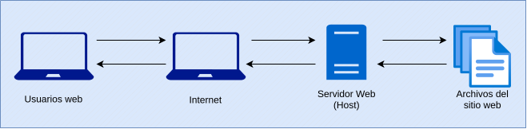

import SubTitle from '../../components/SubTitle.astro';
import Parrafo from '../../components/Parrafo.astro';
import Lista from '../../components/Lista.astro';
import ListaUl from '../../components/ListaUl.astro'
import Blockquote from '../../components/Blockquote.astro';
import Layout from '../../layouts/Layout.astro';

export const components = {p: Parrafo, ol: Lista, ul: ListaUl,  blockquote: Blockquote};

<SubTitle subtitle="¿Que es el Internet?" center='true'/>
Antes de explicar lo que es que Internet debemos entender lo que es una red, para que se entienda mediante un ejemplo, en tu casa todos tus dispositivos electrónicos están conectados entre si, ya sea por WiFi, Bluetooth o por simplemente un cable, esta interconectividad permite compartir cualquier archivo de forma fácil y sencilla.. esta interacción entre dispositivos se llama Red, ahora tu vecino o amigo también tiene su propia red interna, ahora como harías para que esta redes esten comunicadas o conectadas? y si toda una comunidad o ciudad quiere tener esa comunicación o conectividad? o tal vez todo un pais o paises? regiones o continentes? Exacto... teniendo este pensamiento podemos decir que

> Internet es un red de redes

El Internet a diferencia del ejemplo anterior, fue desarrollada a finales de la década de 1960 por el Departamento de Defensa de los Estados Unidos como un medio para crear una red de comunicación descentralizada que pudiera resistir un ataque nuclear (_How Does the Internet Work? - Cs.fyi_, 2023)

<SubTitle subtitle="¿Como funciona el Internet?" style="mono" color="jblue"/>
A grandes rasgos, Internet es un conjunto de dispositivos y sistemas informáticos conectados entre si mediante un conjunto de protocolos estandarizados. Estos protocolos permite y garantiza que los datos trasmitidos sea fiable y segura.

<SubTitle subtitle="¿Como encuentran mi dispositivo?" style="mono" color="jblue"/>
Si un amigo me envía una foto a mi laptop o PC, como me encuentra? Simplemente se debe especificar a que dispositivo. En el momento que estas conectado a una red cuentas con una dirección única llamada IP (Internet Protocol), esta compuesto por una serie numérica seguida de puntos ejem: 192.168.2.10
Tranquilo, se que estas pensando, son muchos números no van a recordar si quiero compartir mi dirección o si quiero visitar paginas web... es por eso con ese mismo propósito de convertir esta serie numérica a algo que si podamos recordar y asociar existe el dominio.
El dominio por ejem google.com es el famoso buscador que abres para buscar información y tiene como IP 173.194.121.32 pero vaya recordar estos números.. me quedo mejor con el dominio.
  <SubTitle subtitle="¿Que es HTTP?" style="mono" color="jblue"/>
El Protocolo de Transferencia de Hipertexto (HTTP - Hypertext Transfer Protocol) es la base de la World Wide Web (WWW) y se utiliza para cargar paginas web mediante enlaces de hipertexto. Un flujo típico implica que el cliente realice una petición a un servidor, y este envía un resultado de respuesta (_What Is HTTP?_, 2023)
  <SubTitle subtitle="¿Que contiene una solicitud HTTP?" style="mono" color="jblue"/>
La solicitud de HTTP es la forma que la plataformas de comunicación de Internet, cada solicitud lleva un conjunto de datos que transportar diferente tipos de información.

1. (1) Tipo de versión HTTP
1. (2) URL
1. (3) Un Método HTTP - GET, POST, PUT, DELETE
1. (4) Encabezados de solicitud HTTP
1. (5) Cuerpo HTTP (opcional)

<SubTitle subtitle="¿Como funciona un Hosting o alojamiento web?" style="mono" color="jblue"/>

El hosting es un servidor en donde alojas tu pagina o servicio web, este servidor en si es una computadora física, esta "computadora" puede ser tu PC, laptop, propio o de otra persona, de una empresa, la velocidad de entrega de información dependerá que tal complejo es tu dispositivo. Empresas grandes como Google o Microsoft tienen un centro de servidores adecuados y especializados para ofrecer un servicio de calidad y optimizado.

<SubTitle subtitle="Tipos de Hosting" style="mono" color="jblue"/>
- **Hosting compartido:** Así como indica el nombre, tu sitio web esta compartiendo el alojamiento con otra persona u empresa, esta opción es la mas simple y común en servicios de Hosting.

- **Hosting de servidor privado virtual (VPS):** Es un servicio mas costoso por que en teoría es un tipo de hosting en donde es dedicado para tu sitio web, lo digo en teoría por que técnicamente sigue siendo compartido. Los Hosting VPS ofrecen una mayor personalización y rendimiento.

